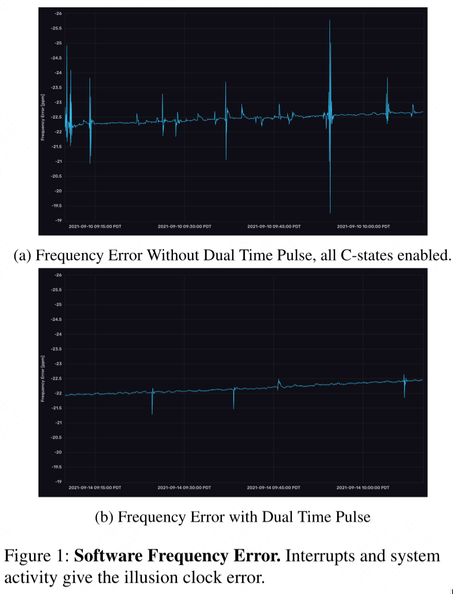

# Document Title

文章大半在科普怎么做一个靠谱的时钟，挺有意思的，等下记一下

首先我们有一个记号ppm(parts per million)，1e-6

# Introduction

时钟会偏移，Spanner就假设了自己的时钟200ppm的偏移，即1s偏移200us。本篇文章的目标就是构造一个ppm小的时钟服务。

# Clock Generation and Synchronization

## A typical Linux Intel x86 clock system

本篇文章聚焦在TSC(timestamp counter)时钟上，这个时钟可以被clock_gettime访问，它由一个时钟信号BLCK驱动（100MHz)，BLCK又是被phase-locked loop（PLL）驱动，源自石英晶体。

大多Linux发行版依赖`ntpd`或者`chrony`通过将本地时钟与remote时钟同步，remote时钟通常是基于GPS通过NTP协议跟wall clock time(UTC)同步。NTP协议通过round-trip delay估算client/server间的网络延迟，能够达到1ms-100ms的同步误差。由于NTP不是硬件协议，调度与中断让它没法将误差降到0.5ms以下

为了增加准确性(<1ms)，PTP(IEEE 1588)被用来减少软件jitter：
1. PTP server周期性广播当前时间
2. 客户端通过发特别的消息来估算延迟
3. 在网卡上引入新的硬件时钟，网卡可以捕获时钟同步的包来减少软件jitter

## Holdover Time
*holderover time*: 时钟不依赖同步能维持多久准确
比如Spanner假设最高200ppm(200us)的偏移，如果最多只能容忍1us的不准确读($\epsilon$)，那么holdover时间只有5ms。用公式表示就是
$t_h=\frac{\epsilon}{df}$
其中$t_h$是holdover time,$\epsilon$是最大的时间不准确度，$df$是时钟偏移

## Characterizing Oscillator Error
时钟信号由振荡器（oscillator)产生，最常见的oscillator是石英晶体。但是有很多因素会影响石英振荡的频率
1. 石英的切割方法：50ppm以内
2. 使用时间：5ppm/year
3. 温度：30ppm-100ppm
4. 电压：0.1ppm-5ppb
5. 加速度：0.1-10ppb/G
6. 相对论效应：距离地心越近 → 引力场越强 → 时间流逝越慢 → 晶振频率越低，0.1ppq/m

## Debunking the Myth of Unstable Clocks
从上一节可以看到，最主要的因素是静态的或者温度

NTPd和chrony都通过*driftfile*学到这种static drift

## Software Temperature Compensation
# Clocks and Sensors In Servers
## Clocks
Linux的pulse-per-second(PPS)提供了API来定义PPS源。PPS源是每秒会发送一个信号，收到信号后，PPS驱动会调用`pps_event`，内核会记录信号对应的时间戳。通常情况下，这个信号会导致中断，interrupt service routine (ISR)会调用PPS API。但是即使使用很好的PPS设备，还是会有10ns的抖动

为了精确地捕捉到PPS信号，我们需要低延迟中断。最终作者用了legacy的串行接口(device carrier detect (DCD) 引脚和clear to send (CTSf line))。与PCIe和USB不同，这些传统端口在低引脚数（LPC）总线上驱动中断引脚，提供了1微秒量级的抖动。但是即使用这些串行断口，PPS仍有一些尖刺，作者想了一些解决方案：
1. 把串行端口中断绑到一个核上，关闭电源管理，关闭watchdog，安装"lowlatency"内核，打开interrupt threading，将串行中断优先级调成实时
   但是这些只减少了尖刺的频率
2. 将机器的C-state（C-state用于控制CPU在不活动时可以进入的休眠级别）调成C0，禁止idle
其中2跟CPU的特性`FEATURE_NONSTOP_TSC`不符，期望是TSC不受C-State影响。作者猜测是CPU进入idle状态后需要非确定的时间醒来再发送ISR信号

为了解决这种情况，作者用了两个时间脉冲源，第二个比第一个有400ns的延迟，然后把内核的PPS驱动改成如果第二个脉冲离第二个脉冲差400ns±100ns才记录第二个脉冲。

## Sensors
我们希望知道时钟的温度，这样我们就能根据温度去调整接受到的时间信号。但是时钟并没有专用的温度传感器，已有的传感器跟时钟的距离千差万别
## Estabilishing the Ground Truth
我们的目标是想要建立温度跟时钟偏移的关系，这样我们就能在软件层面补偿了。一些文献指出石英频率误差跟温度的差不多是
$\Delta f_T=k_0+k_1T+k_2T^2+k_3T^3$
其中$T$是温度，$k_0,k_1,k_2,k_3$需要我们通过实验找出来。
# Evaluation
三个问题：
* 从如NTP那样有噪音的同步通道学参数是否有效
* Graham可以达到怎样的holdover time，可以容忍多少同步失败
* Graham能容忍温度的极具变化吗
## Learning over PPS
做一个baseline。每秒产生一组新的参数
## Learning over NTP
## Holdover
## Rapid Changes
